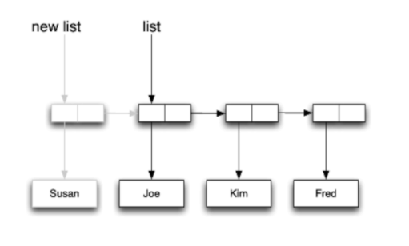
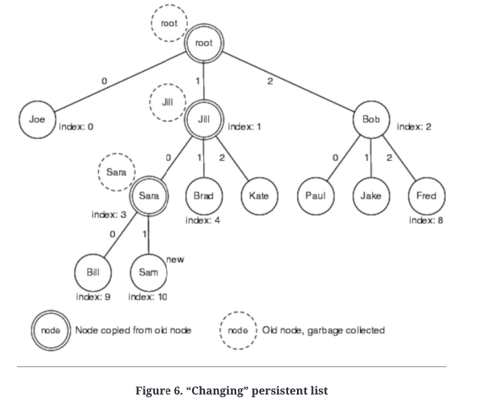

# Chapter 3: Design Approaches
We can't avoid manipulating state. However, we can manipulate state not by mutating it, but by transforming it.

  - [Dealing with state](#dealing-with-state)
  - [Exploring Design Options](#exploring-design-options)
  - [Shared mutable design](#shared-mutable-design)
  - [Isolated mutable design](#isolated-mutable-design)
  - [Purely immutable design](#purely-immutable-design)
  - [Persistent/Immutable data structures](#persistentimmutable-data-structures)
    - [Immutable Lists](#immutable-lists)
    - [Persistent Tries](#persistent-tries)
  - [Seleting a design approach](#seleting-a-design-approach)
  - [Recap](#recap)

## Dealing with state
No ways to escape from dealing with state, but there are different ways to do it:
 * Shared mutability - memory is shared across threads and access to it is synchronized
 * Isolated mutability - memory is mutable but not shared beyond a single thread. Anything shared between threads is immutable
 * Pure immutability - nothing is allowed to change. Very hard to design for this due to our inexperience.

## Exploring Design Options
In the next sections, different design options will be explored to solve the same problem - calculating the total years of experience of people in a room.

## Shared mutable design
Write 0 on a board and ask everyone to go and increment the score with their YoE.

Problems:
 * Must ensure every single one of the actors mutates memory correctly
 * Creates a lot of contention

## Isolated mutable design
Put up your phone number on the board and ask everyone to message you their YoE.

By isolating the mutable variable, there are no problems with contention or synchronization risks.

## Purely immutable design
Everyone in the room forms a chain & passes a number to the person next in the chain - the current total + their YoE.

Harder to design this solution but doable. In programming, this can be achieved by leveraging function composition.

## Persistent/Immutable data structures
The immutable design comes with a cost - if we are to copy the exchanged objects every single time, that would be slow if they are very big.

This can be solved by using persistent/immutable data structures.

Persistent data structures version their values so that older values stay around as time goes on.
Since the data is immutable, it is shared effectively to avoid copy overhead. The data structures are optimized for effective updates.

Scala & Clojure use these extensively.

### Immutable Lists
New entries in the list are appended to its end without modifying existing entries. Other references to the list still point to the old list:

The addition takes constant time irrespective of list size.

### Persistent Tries
Sometimes, we can't get away with lists because of data is organized like a tree or a hashmap.
These can be implemented using persistent tries.

Persistent trie changes happen by copying all nodes in the path of the change.

Example by adding value "Sam":

## Seleting a design approach
Most of the concurrency issues can be avoided by using isolated mutability or pure immutability.
Programming with isolated mutability is easier and more practical.

Isolated mutability can be achieved using Actor-based frameworks or leveraging Java's concurrency library.
Pure immutability is harder to achieve in object-oriented languages. 

Also, it is mentally harder to work with as it needs more sophisticated algorithms favoring immutability as well as using persistent data structures.

## Recap
We can't avoid dealing with state. Our options:
 * Shared mutability
 * Isolated mutability
 * Pure immutability

Avoiding shared mutability is the easiest way to avoid synchronization woes.
